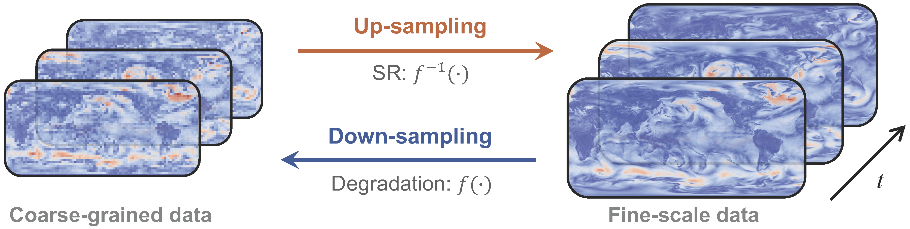
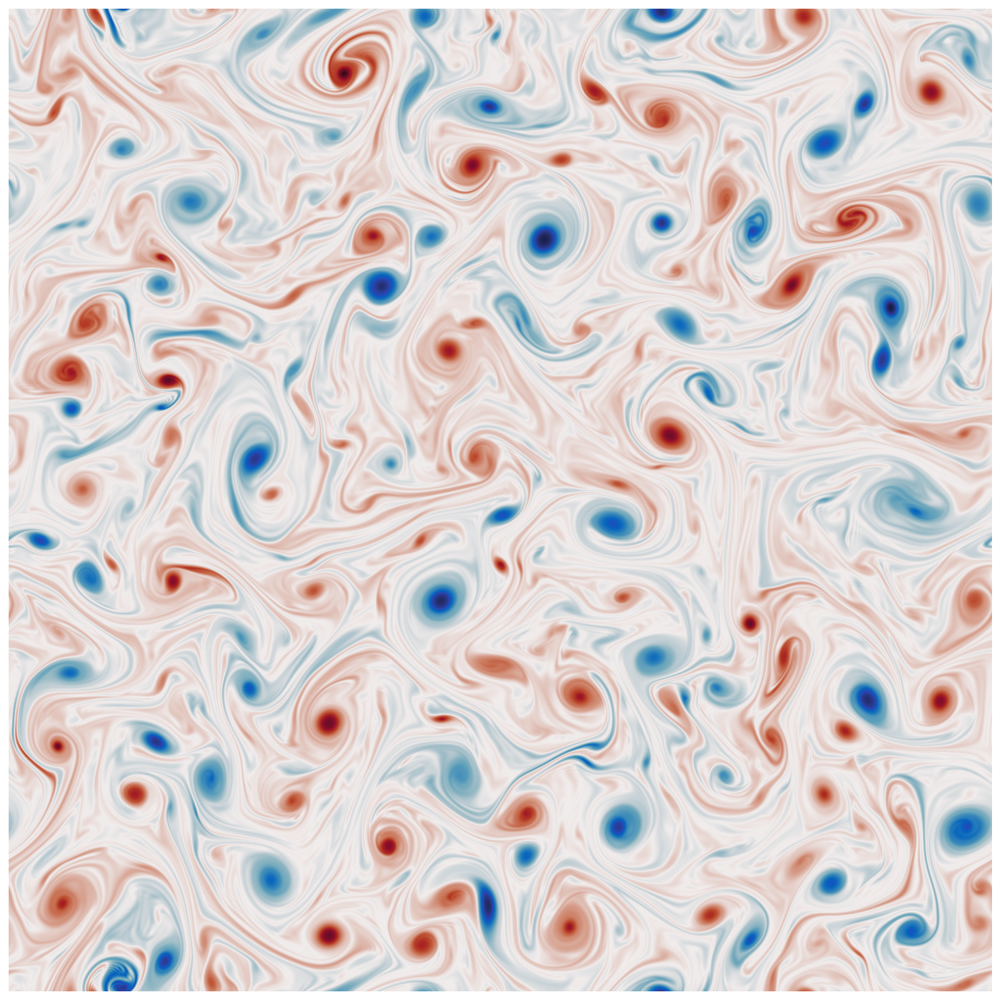
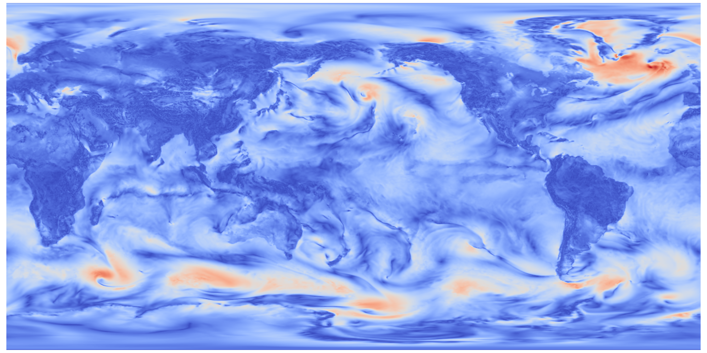
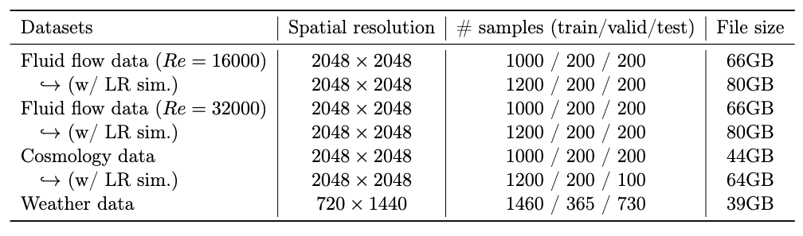
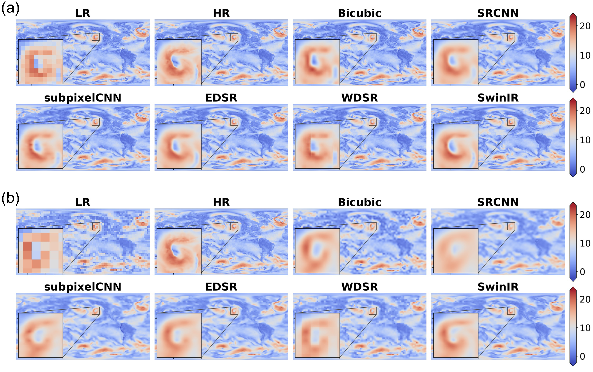
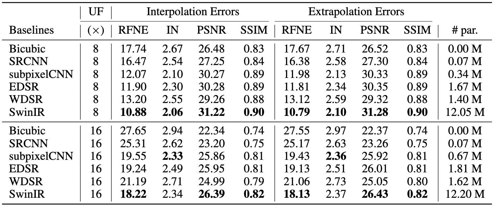

---

SuperBench is a benchmark dataset and evaluation framework for super-resolution (SR) tasks in scientific domains. It provides high-quality datasets and baseline models for evaluating and comparing SR methods in various scientific applications.

<p align="center">
    
</p>
<p style="text-align: center;">An overview of super-resolution for weather data</p>


## Highlights

- Diverse datasets: SuperBench includes high-resolution fluid flow (left), cosmology (right), and weather datasets (middle) with dimensions up to $2048\times2048$. 


<p align="center" width="100%">
    
    
    
</p>

- Evaluation metrics: The framework provides comprehensive evaluation metrics for assessing SR performance, including: 
    - Pixel-level difference
    - Human-level perception
    - Domain-motivated error metrics
- Baseline models: Pre-trained baseline models are provided to facilitate comparison with state-of-the-art methods.
- Extensible framework: SuperBench is designed to be easily extendable, allowing the inclusion of new datasets and baseline models.

## Datasets

- **Navier-Stokes Kraichnan Turbulence**
    - Two fluid flow datasets are simulated with Reynolds numbers of $Re=16000$ and $Re=32000$. The spatial resolution of this dataset is $1024\times1024$. 
    - Three variables are considered: two velocity variables in the $x$ and $y$ directions, as well as with the vorticity field.
- **Cosmology Hydrodynamics**
    - The spatial resolution is $2048\times2048$. The temperature and baryon density are provided in log scale. 
    - A corresponding low-resolution simulation data is provided for a realistic super-resolution task.
- **Weather data**
    - The weather data is modified from [ERA5](https://cds.climate.copernicus.eu/cdsapp#!/dataset/reanalysis-era5-complete?tab=overview). The spatial resolution is $720\times1440$.
    - Three channels are considered: Kinetic Energy (KE) at 10m from the surface, the temperature at 2m from surface, and total column water vapor.

<p style="text-align: center;">Table 1: A summary of SuperBench dataset.</p>
<p align="center">
    
</p>


## Baseline models

- Bicubic interpolation
- SRCNN, 
    - Paper: [Image Super-Resolution Using Deep Convolutional Networks](https://arxiv.org/abs/1501.00092) 
    - Venue: TPAMI, 2015 (**the first paper using deep NNs**)
- Subpixel CNN 
    - Paper: [Real-Time Single Image and Video Super-Resolution Using an Efficient Sub-Pixel Convolutional Neural Network](https://arxiv.org/abs/1609.05158)
    - Venue: CVPR, 2016
- EDSR
    - Paper: [Enhanced deep residual networks for single image super-resolution](https://arxiv.org/abs/1707.02921)
    - Venue: CVPR, 2017 (**NTIRE2017 Super-Resolution Challenge winner**)
- WDSR
    - Paper: [Wide activation for efficient and accurate image super-resolution](https://arxiv.org/abs/1808.08718)
    - Venue: BMVC, 2019 (**NTIRE 2018 Super-Resolution Challenge winner**)
- FNO
    - Paper: [Fourier Neural Operator for Parametric Partial Differential Equations](https://arxiv.org/pdf/2010.08895)
    - Venue: ICLR, 2021
- SwinIR
    - Paper: [Swinir: Image restoration using swin transformer](https://arxiv.org/pdf/2108.10257.pdf)
    - venue: CVPR, 2021


## Evaluation metrics

To assess the performance of these methods, we employ three distinct types of metrics: pixel-level difference metrics; human-level perception metrics; and domain-motivated error metrics.

- Pixel-level difference: 
    - relative Forbenius norm error (RFNE)
    - infinity norm (IN)
    - peak signal-to-noise ratio (PSNR)
- Human-level perception: 
    - structural similarity index measure (SSIM)
- Domain-motivated error metrics:
    - physics errors (e.g., continuity loss)
    - Energy Specturm
    - Anomaly Correlation Coefficient (ACC)
    - ...

## Results

We have evaluated several state-of-the-art SR models on the SuperBench dataset across different degradation scenarios. Here are an example result on weather dataset.

### Baseline Performance

We present the baseline performance of various SR models on weather data with bicubi-downsampling degradation. Figure 1 shows visual comparisons of the baseline model reconstructions against the ground truth high-resolution images. (a) and (b) are x8 and x16 up-sampling tasks, respectively. Table 2 below provides quantitative evaluation results for weather data in terms of RFNE, IN, PSNR and SSIM metrics.

<p style="text-align: center;">Figure 1: An example snapshot of baseline performance on weather data.</p>
<p align="center">
    
</p>


<p style="text-align: center;">Table 2: Results for weather data with bicubic down-sampling.</p>
<p align="center">
    
</p>


<!-- <div align='center'>

| <sub>Baselines</sub>    | <sub>UF ($\times$)</sub> | <sub>RFNE (%)</sub> | <sub>IN</sub>| <sub>PSNR (dB)</sub> | <sub>SSIM</sub> | <sub>\# pars (M)</sub> |
|:-----------------------:|:------------:|:----------------:|:---------------:|:----------------:|:----------------:|:----------------:|
| <sub>Bicubic</sub>      | <sub>8</sub> | <sub>17.67</sub> | <sub>2.71</sub> | <sub>26.52</sub> |  <sub>0.83</sub> | <sub>0.00</sub> |
| <sub>SRCNN</sub>        | <sub>8</sub> | <sub>16.38</sub> | <sub>2.58</sub> | <sub>27.30</sub> |  <sub>0.84</sub> | <sub>0.07</sub> |
| <sub>subpixelCNN</sub>  | <sub>8</sub> | <sub>11.98</sub> | <sub>2.12</sub> | <sub>30.33</sub> |  <sub>0.89</sub> | <sub>0.34</sub> |
| <sub>EDSR</sub>         | <sub>8</sub> | <sub>11.81</sub> | <sub>2.34</sub> | <sub>30.35</sub> |  <sub>0.89</sub> | <sub>1.67</sub> |
| <sub>WDSR</sub>         | <sub>8</sub> | <sub>13.12</sub> | <sub>2.59</sub> | <sub>29.32</sub> |  <sub>0.88</sub> | <sub>1.40</sub> |
| <sub>SwinIR</sub>       | <sub>8</sub> | <sub>10.79</sub> | <sub>2.10</sub> | <sub>31.28</sub> |  <sub>0.90</sub> | <sub>12.05</sub> |

</div> -->


### Additional Results

For more detailed results and analysis, please refer to our paper.


### Contribution to trained models

We welcome contributions from the scientific machine learning community. If you would like to contribute to the baseline models of SuperBench, please open an issue on the <u>**GitHub repository**</u>. You may either request to push code to ```src.models``` or provide a link to the trained models with model details. 

## Getting Started

### Installation

To use SuperBench, follow these steps:

1. Clone the repository:

```shell
git clone https://github.com/erichson/SuperBench.git
```

2. Install the required dependencies:
```shell
pip install -r requirements.txt
```

### Usage

1. Download the [SuperBench](https://portal.nersc.gov/project/dasrepo/superbench/superbench_v1.tar) datasets:
```shell
wget https://portal.nersc.gov/project/dasrepo/superbench/superbench_v1.tar
```

2. Run the baseline models on the datasets:

    2.1. Generate ```.sh``` code in the ```make_file``` folder

    ```python
    # if train all baseline models used in SuperBench paper
    python generate_sh.py --gpus 0 1 2 3 --generate_all

    # if train one specific model on one dataset
    python generate_sh.py --model SRCNN --data nskt_16k --gpus 0
    ```

    2.2. Run the ```.sh``` code

    ```shell
    # if train all baseline models used in SuperBench paper
    sh run_train_all.sh

    # if train one specific model on one dataset
    sh run_train_SRCNN_nskt_16k.sh
    ```

3. Evaluate the model performance:

```shell
# evaluate RFNE, IN, PSNR, SSIM and physics loss
# one sample code is provided
run_eval.sh 
```

4. Visualize the SR results
```python
# for bicubic down-sampling
viz.py

# for uniform down-sampling and noise
viz_noise.py

# for low-res simulation data
viz_lres_sim.py  
```

For detailed model configurations, please refer to the the folder ```config```.


### Contribution to datasets

We also welcome dataset contributions from the community. If you would like to contribute to SuperBench, please open an issue on the <u>**GitHub repository**</u> and provide a link to your datasets with data details.

### Issues and Support

If you encounter any issues or have any questions, please open an issue on the <u>**GitHub repository**</u>.


### License

SuperBench is released under the <u>**GNU General Public License v3.0**</u>.
